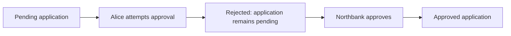

# A story the ledger can prove

Alice needs Northbank to approve her financing application. The business rule is simple: Alice can see the application, but only the bank can approve it.

Read the [story input](../stories/financing-approved/input.md) and [committed expectation](../stories/financing-approved/expected.md). They describe two attempts in order: Alice tries first, then Northbank.

## Run the story

After [setup](setup.md), run:

```sh
scripts/harmonia check stories/financing-approved
```

The Scala runner creates a local Canton environment, translates the input into a Daml Script argument, and submits the attempts. The script queries the contracts after each attempt. The comparator then checks those observations against the expected file.



This diagram explains the committed scenario. The run's `actual.md` records what the ledger actually did; `diff.md` records any disagreement.

## Read the evidence

The terminal prints the run directory. Inside the story's subdirectory:

| File | What it tells you |
| --- | --- |
| `input.json` | The argument sent to the Daml script, derived solely from the Markdown input |
| `observation.json` | Raw script observations, including real contract identifiers and rejection details |
| `actual.md` | The normalized, human-readable result |
| `diff.md` | The fields where expectation and observation disagree |
| `run.json` | Execution mode, source revision, worktree state, toolchain information, and artifact hashes |

In `actual.md`, a rejected attempt should leave the input contract unconsumed. Successful approval should consume the pending contract and leave one approved application visible to Alice and Northbank.

The [already-approved story](../stories/already-approved/input.md) tests another boundary: bank authority alone is insufficient when the application is already approved.

## Try a disagreement

Copy the story to a new directory under `.artifacts/`, preserving its `input.md` and `expected.md`. In the copied expectation, change the bank attempt's expected application state from `approved` to `pending`.

Run `scripts/harmonia check` with that copied directory as its argument. The action should still approve the application, but the check must fail and identify the differing field. The command does not update the golden to make the test pass.

Editing only the explanatory prose leaves the scenario unchanged. Adding an unsupported action or unknown actor fails validation before ledger execution.

## Follow the code

- [Financing application](../on-ledger/financing/daml/Financing.daml): its signatory, observer, controller, and transition condition.
- [Ledger-driving script](../on-ledger/smoke/daml/Story.daml): submits actions and queries their effects.
- [Scala execution slice](../off-ledger/jvm/src/main/scala/harmonia/stories/run/RunStory.scala): translates input and retains observations without receiving the expectation.
- [Pure comparison](../off-ledger/jvm/src/main/scala/harmonia/stories/compare/CompareResults.scala): checks complete result structures and reports differences.

This chapter proves a small application action on one local participant. The reusable Harmonia core and integration across separate applications are the next implementation steps. Separate-participant privacy will require a separate execution topology and its own observations.
