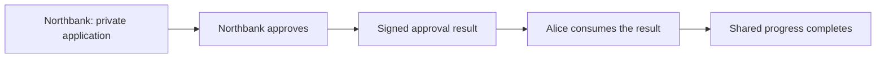

# A private application and a shared next step

Northbank needs to keep its internal application details private. Alice needs an approval to continue her process. Olivia needs to observe progress, but she has no authority to act for either of them.

The [private approval story](../examples/stories/private-approval/input.md) hosts each party on a different participant node. Its [committed expectation](../examples/stories/private-approval/expected.md) checks both action outcomes and visibility.

## Follow the handoff



A bank-signed proposal first authorizes a waiting shared instance, which Alice accepts. Northbank's approval changes its private application and creates a signed result in one transaction. The result contains the issuer, consumer, subject, and decision; it contains no private application payload or private contract identifier. Alice then consumes that result in a separate transaction to complete shared progress.

These are two committed stages. A wait between them is an intentional part of the workflow. The shared transition accepts only an approval from the configured issuer, for the configured subject and consumer. Consuming the result prevents another use of that contract.

## Try the boundaries

```sh
scripts/harmonia check examples/stories/private-approval
```

The six attempts demonstrate the roles:

1. Alice cannot create a forged completed shared instance without the bank's signature.
2. Alice cannot exercise the private application she cannot observe.
3. Alice cannot complete shared progress before an approval result exists.
4. Northbank approves its application and issues the result; shared progress remains waiting.
5. Olivia can observe shared progress but cannot perform Alice's continuation.
6. Alice consumes the signed approval and completes the shared step.

After execution, the script queries private application and shared progress visibility for all three parties. The Scala runner also reads each party's event history from its own participant, including events for contracts that are now archived.

## Inspect participant evidence

Open the printed run directory using the [playback guide](playback.md). In **Participant evidence**, select Northbank, Alice, or Olivia. The panel compares the actual queries and event history with the golden.

| Observation | Northbank | Alice | Olivia |
| --- | --- | --- | --- |
| Private application visible | Yes | No | No |
| Shared progress visible | Yes | Yes | Yes |
| Private application create events | 2 | 0 | 0 |
| Shared progress create events | 2 | 2 | 2 |
| Private payload appears in events | Yes | No | No |

The shared events are positive controls: the streams contain real observations. The bank's stream is also a positive control for detecting the private payload. An unavailable stream or a missing positive control aborts the check; it cannot prove privacy.

The evaluation bundle contains the collected evidence from all three parties so a reader can compare them. Selecting a recorded participant does not authenticate a live session.

## Follow the implementation

- [Private application](../on-ledger/applications/private-financing/daml/PrivateFinancing.daml): bank ownership and the private approval action.
- [Signed result](../on-ledger/interfaces/daml/Harmonia/Result.daml): the issuer, designated consumer, and single-use choice.
- [Shared progress](../on-ledger/core/daml/Harmonia/SharedProgress.daml): validation and continuation owned by Alice.
- [Multi-participant script](../on-ledger/tests/daml/Privacy.daml): submissions and synchronized party-specific queries.
- [Event observation](../off-ledger/jvm/src/main/scala/harmonia/ledger/events/LedgerEvents.scala): bounded Ledger API history requests.

The local topology has three independently identified participant nodes with separate in-memory stores and API endpoints, one common synchronizer, and one hosting JVM. This proves the demonstrated ledger visibility boundary; it is not a deployment with separate operating-system or administrator trust boundaries.

## Try two live sessions

The recorded perspective selector lets you inspect evidence already captured by
the checker. The [live walkthrough](../docs/live.md) connects separate bank,
buyer, and observer sessions to their own authenticated participant clients.
Approve in the bank tab, continue in the buyer tab, and reload to recover the
committed state. The private payload stays in the bank's view.

The [live input](../examples/evaluations/live-handoff/input.md) and its
[expected result](../examples/evaluations/live-handoff/expected.md) use the same Markdown
story language. `scripts/harmonia live-check` repeats the handoff and tests direct
API attempts to bypass the displayed controls. Inspect the
[session architecture](../docs/architecture/009-live-sessions.md) to follow the
credential and command boundaries.
