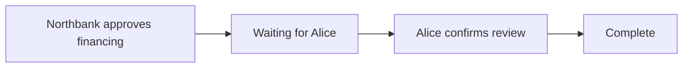
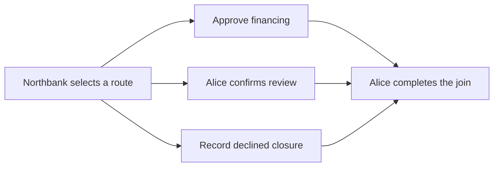

# Progress survives the client

A financing approval and a buyer's review are separate application actions. The published workflow says which one comes first, who performs each action, and when the whole process is complete.

Compare the [uninterrupted story](../examples/stories/sequence-complete/input.md) with the [resumed story](../examples/stories/sequence-resumed/input.md). Both must finish with one approved financing application and one confirmed review. The second story adds failed attempts, a retry, a wait, and a fresh client.

## The ledger keeps the plan and progress

The definition is published as `approval-review`, version 1. Its two steps are financing, assigned to the bank, and review, assigned to the buyer. Review requires financing to be completed first.



The workflow instance stores the published definition's identity, its versioned content, role and application bindings, completed steps, and request receipts. It derives enabled steps from that persisted state. The application action and the corresponding workflow transition commit together.

The definition publisher signs workflow state. Owners initiate a process through the publisher's checked `Start` choice. Ordinary owners cannot manufacture a completed instance without the publisher's authority. The publisher is a trusted provisioning role, and business submitters do not receive its credentials.

## Run both paths

```sh
scripts/harmonia check examples/stories/sequence-complete examples/stories/sequence-resumed
```

The [uninterrupted expectation](../examples/stories/sequence-complete/expected.md) shows the normal two-step progression. The [resumed expectation](../examples/stories/sequence-resumed/expected.md) additionally checks:

- A direct attempt to create a forged completed instance is unauthorized.
- A review before financing is rejected.
- Repeating the bank request with the same `request` identifier returns the existing state as `duplicate`.
- Repeating the completed step with a new request is rejected.
- Waiting and reconnecting report `observed`; they change no application or workflow contracts.
- Alice can finish from the state recovered by a fresh client.

The optional `request` field makes intentional retries explicit. Without it, the action's `id` is the request identifier. Receipts are stored in the instance and bind the identifier to the step and actor. Reusing an identifier for another action is rejected. This is workflow-level idempotency; it does not depend on a participant's transport-level command-deduplication window.

## Inspect the restart evidence

The runner starts a fresh Daml Script client for setup and for every attempt. Each client reads the current instance from the ledger using the published definition, publisher identity, and story reference. It does not receive a locally cached list of completed steps.

Under the printed story directory, `setup/` and each `attempt-NN/` retain their input, raw observation, log, and `client.pid`. The root `observation.json` collects the observations used for the golden. The reconnect attempt's process ID and queried state make the restart concrete.

Open the run in the [book viewer](playback.md). The detail table shows the completed and enabled steps, review state, and application effects alongside the expected result.

## Keep creation and transition authority aligned

The private handoff from [Chapter 3](03-participant-views.md) uses the same principle: a bank-signed proposal authorizes a waiting shared instance, and the buyer accepts that proposal. Its shared state requires both bank and buyer signatures. The buyer's direct attempt to forge completion is part of the privacy golden; a signed approval is required for the normal continuation.

## Follow the code

- [Definition model](../on-ledger/core/daml/Harmonia/Process/Model.daml): versioned steps, prerequisites, roles, and receipts.
- [Process engine](../on-ledger/core/daml/Harmonia/Process/Engine.daml): checked creation, authorization, idempotency, and atomic advancement.
- [Review application](../on-ledger/applications/review/daml/Review.daml): Alice's independent application action.
- [Fresh-client script](../on-ledger/tests/daml/Sequence.daml): queries and submits one attempt per invocation.
- [Scala runner](../off-ledger/jvm/src/main/scala/harmonia/stories/run/process/RunProcessStory.scala): owns execution and artifacts through `IO`.

Definitions are immutable, and active instances retain their chosen version. The publisher must keep the referenced definition available while instances are active.

## Choose one path, then join its work

The [approved branch](../examples/stories/branch-approved/input.md) and [declined branch](../examples/stories/branch-declined/input.md) use one exclusive decision. Northbank chooses the route. Choosing approval records an intention; the financing application must still approve its own action.



On the approved route, financing and review are both enabled. Either may happen first, in separate transactions. The join waits for both. The closure step is skipped. On the declined route, closure is required and financing/review are skipped. A skipped step never becomes completed, and its application contract remains unchanged. The join merges the chosen route; it does not retrospectively make earlier transactions atomic.

```sh
scripts/harmonia check examples/stories/branch-approved examples/stories/branch-declined
```

Inspect the [approval expectation](../examples/stories/branch-approved/expected.md): joining before the decision fails, changing a recorded decision fails, and exercising the unselected closure fails. Even after financing approves, the join still waits for review. After completion, a matching join request returns `duplicate`; a new request cannot complete the same join again. The [decline expectation](../examples/stories/branch-declined/expected.md) proves the other route and rejects its unselected financing action.

## The supported graph has clear limits

This edition supports acyclic action dependencies, or one exclusive decision with two to four options, conditional application actions, and one exhaustive join. A decision's selected option is persisted and cannot change. Actions in each branch may have ordered dependencies or run independently. Every conditional action must explicitly require the decision; dependencies across different options are rejected.

The join must name all conditional actions. Each option must contain an action, and every prerequisite must name an earlier step. These rules reject cycles, missing references, incomplete joins, empty options, nested decisions, and unsupported branch shapes before an instance can start. The definition has at most sixteen steps. [Definition checks](../on-ledger/tests/daml/DefinitionTests.daml) attempt to publish eleven malformed definitions and require rejection.

The diagram displays possible routes. The laboratory's completed, skipped, enabled, and selected-branch fields show the actual recorded route. Layout is presentation; prerequisite edges and the ledger observations determine causality.
