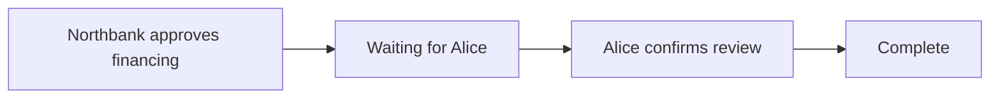

# Progress survives the client

A financing approval and a buyer's review are separate application actions. The published workflow says which one comes first, who performs each action, and when the whole process is complete.

Compare the [uninterrupted story](../stories/sequence-complete/input.md) with the [resumed story](../stories/sequence-resumed/input.md). Both must finish with one approved financing application and one confirmed review. The second story adds failed attempts, a retry, a wait, and a fresh client.

## The ledger keeps the plan and progress

The definition is published as `approval-review`, version 1. Its two steps are financing, assigned to the bank, and review, assigned to the buyer. Review requires financing to be completed first.



The workflow instance stores the published definition's identity, its versioned content, role and application bindings, completed steps, and request receipts. It derives enabled steps from that persisted state. The application action and the corresponding workflow transition commit together.

The definition publisher signs workflow state. Owners initiate a process through the publisher's checked `Start` choice. Ordinary owners cannot manufacture a completed instance without the publisher's authority. The publisher is a trusted provisioning role, and business submitters do not receive its credentials.

## Run both paths

```sh
scripts/harmonia check stories/sequence-complete stories/sequence-resumed
```

The [uninterrupted expectation](../stories/sequence-complete/expected.md) shows the normal two-step progression. The [resumed expectation](../stories/sequence-resumed/expected.md) additionally checks:

- A direct attempt to create a forged completed instance is unauthorized.
- A review before financing is rejected.
- Repeating the bank request with the same `request` identifier returns the existing state as `duplicate`.
- Repeating the completed step with a new request is rejected.
- Waiting and reconnecting report `observed`; they change no application or workflow contracts.
- Alice can finish from the state recovered by a fresh client.

The optional `request` field makes intentional retries explicit. Without it, the action's `id` is the request identifier. Receipts are stored in the instance and bind the identifier to the step and actor. Reusing an identifier for another action is rejected. This is workflow-level idempotency; it does not depend on a participant's transport-level command-deduplication window.

## Inspect the restart evidence

The runner starts a fresh Daml Script client for setup and for every attempt. Each client reads the current instance from the ledger using the published definition, publisher identity, and story reference. It does not receive a locally cached list of completed steps.

Under the printed story directory, `setup/` and each `attempt-NN/` retain their input, raw observation, log, and `client.pid`. The root `observation.json` collects the observations used for the golden. The reconnect attempt's process ID and queried state make the restart concrete.

Open the run in the [book viewer](playback.md). The detail table shows the completed and enabled steps, review state, and application effects alongside the expected result.

## Keep creation and transition authority aligned

The private handoff from [Chapter 3](03-participant-views.md) uses the same principle: a bank-signed proposal authorizes a waiting shared instance, and the buyer accepts that proposal. Its shared state requires both bank and buyer signatures. The buyer's direct attempt to forge completion is part of the privacy golden; a signed approval is required for the normal continuation.

## Follow the code

- [Definition model](../on-ledger/core/daml/Harmonia/Process/Model.daml): versioned steps, prerequisites, roles, and receipts.
- [Process engine](../on-ledger/core/daml/Harmonia/Process/Engine.daml): checked creation, authorization, idempotency, and atomic advancement.
- [Review application](../on-ledger/review/daml/Review.daml): Alice's independent application action.
- [Fresh-client script](../on-ledger/smoke/daml/Sequence.daml): queries and submits one attempt per invocation.
- [Scala runner](../off-ledger/jvm/src/main/scala/harmonia/stories/run/sequence/RunSequenceStory.scala): owns execution and artifacts through `IO`.

Definitions are immutable, and active instances retain their chosen version. The publisher must keep the referenced definition available while instances are active. This edition demonstrates a sequential definition; the next increment adds explicit branch and join semantics.
