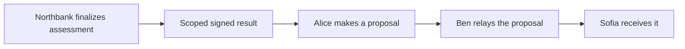

# A private assessment enables a separate offer

Alice wants to make an offer for Riverside 17. Northbank reviews her documents. Ben operates the buyer-side offer application, and Sofia receives the proposal on the seller side. Each party acts through its own participant and application authority.

The [successful story](../examples/stories/purchase-approved/input.md) starts after Alice has submitted her documents and Northbank has recorded its intended assessment. Finalizing that assessment is still a bank-authorized ledger action. This synthetic example tests coordination and authority; it does not implement credit underwriting or document verification.



## The applications own their rules

The [financing package](../product/ledger/applications/property-financing/daml/PropertyFinancing.daml) owns document submission, review, and the final assessment. The [offer package](../product/ledger/applications/property-offer/daml/PropertyOffer.daml) owns offer preparation, proposal creation, relay, and receipt. Neither imports the other. They share Harmonia's action interface and signed-result contract.

Four small versioned definitions govern assessment, proposal, relay, and receipt. Their publishers are the bank, buyer's agent, and seller's agent as appropriate. The core executes an application's actual interface choice. It cannot approve financing, create a proposal, or relay it by changing a browser status.

Opening an offer is preparation: Alice accepts the agent's invitation and starts the corresponding workflow in two staged transactions. Creating the proposal then consumes the proof, creates the proposal, updates the offer, and advances its workflow atomically. For relay and receipt, the agent starts its one-step continuation and exercises it in one transaction. Earlier stages remain separate committed transactions.

## A certificate has a specific purpose

The offer checks five facts in the signed result:

- **Issuer:** the expected bank.
- **Consumer:** Alice, the intended buyer.
- **Subject:** this financing application.
- **Decision:** approved.
- **Continuation:** this exact agreed offer reference.

The result contains no documents. Proposal creation consumes it, so another prepared offer cannot reuse it. A buyer cannot directly forge the proposal template: both buyer and agent signing authority are required, and the agent's invitation permits only a waiting offer.

## Follow the successful handoff

```sh
scripts/harmonia check examples/stories/purchase-approved
```

Open the printed run in the [book viewer](playback.md). The [expectation](../examples/stories/purchase-approved/expected.md) shows the bank's private workflow rejecting Alice's assessment attempt, then the bank completing its assessment. A forged proposal is unauthorized. Alice prepares and creates the real proposal. Sofia's premature receipt fails, Ben relays it, and Sofia can then receive it.

The detail table distinguishes the current offer, its current proposal, total active proposals, and whether the bound result remains active. Completed steps come from the actual domain workflow contracts. The workflow is complete only when its current proposal has been received.

The participant view records both contract queries and complete party-filtered event observations. Alice and Northbank see the document payload. Ben and Sofia see no document payload or private financing creation events. The bank does not see the offer contracts. The recorded book is an operator's synthetic evidence bundle; switching its displayed perspective grants no live credentials.

## Try the rejected paths

Each experiment has an independent committed expectation:

| Experiment | Input | Expected consequence |
| --- | --- | --- |
| Bank rejection | [Rejected financing](../examples/stories/purchase-rejected/input.md) | Assessment completes, but no purchase proposal is authorized |
| Wrong issuer | [Issuer fixture](../examples/stories/purchase-wrong-issuer/input.md) | A self-issued result cannot stand in for the bank |
| Wrong application | [Subject fixture](../examples/stories/purchase-wrong-subject/input.md) | Another application's result cannot authorize this offer |
| Wrong buyer | [Consumer fixture](../examples/stories/purchase-wrong-buyer/input.md) | A result for another party is rejected |
| Wrong continuation | [Continuation fixture](../examples/stories/purchase-wrong-continuation/input.md) | Approval does not authorize a different offer reference |
| Missing reference | [Missing evidence](../examples/stories/purchase-missing/input.md) | Passing no result cannot authorize a proposal, even if financing has produced one |
| Reused reference | [Consumed evidence](../examples/stories/purchase-reused-proof/input.md) | A second prepared offer cannot create another proposal from the consumed result |

The invalid-result fixtures are signed ledger contracts created during setup, with their defect named explicitly in the input. They are not edits to a captured success flag. The rejected attempt must leave the offer waiting and its proposal count unchanged.

In the reuse experiment, the first offer and proposal remain on the ledger. The second prepared offer is the current one displayed by the story, while the active-proposal count still includes the first proposal. A consumed contract reference remains a historical reference; it is not an active authorization.

## Reproduce and inspect

Run all purchase stories with `scripts/harmonia check examples/stories/purchase-*`. Raw observations include action errors, contract identifiers, party queries, and the participant event streams used for the privacy assertions. Each run records source and artifact digests. [The architecture decision](../docs/architecture/006-financing-and-offer.md) explains the ownership and continuation boundaries.

The fixture runs four participant nodes with distinct identities, stores, and endpoints in one local JVM and one synchronizer. The bank is trusted to issue its own assessment results. Administrative access to the fixture is separate from business authorization; authenticated live sessions arrive in the later viewer increment.
