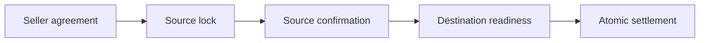

# Four parties, one final transaction

A buyer receives a position held by a seller at a source custodian. A destination custodian agrees to receive it. Each party has its own local Canton participant. The example uses synthetic `TEST` units, with no payment leg or external asset network.

The **Settler** submits the final action. This is a role assigned to one of the four parties. The successful examples use Alice and the source custodian respectively; no fifth coordinating party acquires ownership of the trade.

## Read the preparation separately

The source allocates the position, the seller accepts it, and the buyer proposes the trade and a receiving request during setup. Afterward, each story lists the visible business actions:

1. Seller agrees to the trade.
2. Seller locks the source position.
3. Source confirms the actual locked contract and complete trade terms.
4. Destination prepares the buyer's receiving permit.
5. Destination confirms that permit for this trade.
6. Settler executes the final workflow step.

Each preparation is a committed transaction. A rejected final action leaves those preparations in place. In particular, the source remains locked until an explicitly supported later operation changes it; this reference does not implement cancellation or expiry.



## What happens inside settlement

The coordinator's trade contract carries the consent accumulated from all four parties. The final choice first exercises withdrawal of the locked source position. It then presents the resulting typed release to the destination's receipt choice. The destination consumes that release and creates the buyer's holding. The coordinator creates the settled trade, and Harmonia records the completed step.

These changes are one Daml update submitted as one transaction. The custody packages depend on common transfer terms, while the coordinator depends on both typed custody packages. Neither custody application imports the other or the workflow engine.

The custody choices require all four parties' authority. The agreed coordinator supplies that authority for its consequences; the Settler cannot directly withdraw using only its own submission identity. The [successful story](../examples/stories/transfer-approved/input.md) includes that rejected bypass before settlement.

## Follow the quantities

Open **Transfer: approved** in the story laboratory. Select the seller's agreement, lock, and settlement attempts. The balance bars move from source available, to source locked, to destination received. The exact quoted quantities also appear in the expected/observed table.

The [committed expectation](../examples/stories/transfer-approved/expected.md) requires one settlement transaction containing all four kinds of effects: source retirement, destination holding, settled trade, and completed workflow. The runner obtains this count from the Settler's real ledger event stream. Raw observations retain the transaction identifier and the contract identifier used to match source retirement.

The [source-as-Settler story](../examples/stories/transfer-source-settler/input.md) transfers **7.125** units. Decimal normalization preserves exact values; the browser's bars are a visual aid and do not determine business arithmetic.

## Try the failed final leg

Select **Transfer: final leg rejected** and move to its last attempt. The destination's synthetic receipt rule rejects after source withdrawal is attempted inside the transaction. The raw ledger error identifies that destination assertion.

The [expected result](../examples/stories/transfer-final-leg-rejected/expected.md) requires the source to retain ten locked units, the destination to retain zero, and no active release or workflow instance to remain. The trade stays ready. The complete recording contains zero settlement transactions. This proves rollback of the eligible final path, including the temporarily started workflow.

Compare that failure with [missing seller agreement](../examples/stories/transfer-missing-agreement/input.md), [missing lock](../examples/stories/transfer-missing-lock/input.md), and [missing readiness](../examples/stories/transfer-missing-readiness/input.md). Those attempts fail at their own earlier prerequisite. Readiness grants permission to attempt receipt; the destination still enforces its business rules when it receives.

## Reproduce and extend

```sh
scripts/harmonia check examples/stories/transfer-approved examples/stories/transfer-final-leg-rejected
scripts/book .artifacts/check-RUN
```

The initial bound is one complete position, one release, one destination receipt, and one core action. Quantities are positive, at most one trillion, with at most ten decimal places. There is no splitting, aggregation, fee calculation, payment exchange, cancellation, expiry, or arbitrary atomic graph. The graph's earlier consent stages are deliberately outside the final transaction.

Read the [architecture decision](../docs/architecture/007-atomic-transfer.md), [source custody](../on-ledger/applications/source-custody/daml/SourceCustody.daml), [destination custody](../on-ledger/applications/destination-custody/daml/DestinationCustody.daml), [coordinator](../on-ledger/applications/transfer/daml/AtomicTransfer.daml), and [event-backed runner](../off-ledger/jvm/src/main/scala/harmonia/stories/transfer/run/RunTransferStory.scala).
