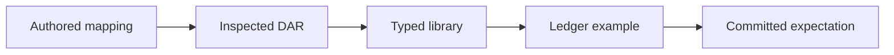

# Generate an adapter from a deliberate mapping

Chapter 2 integrated an unchanged financing DAR with a hand-written adapter. This chapter turns that proven pattern into a Scala tool. The author supplies a small mapping; the compiler supplies the source's types; a real ledger execution checks the result against a committed expectation.

## Explain what the fields mean

The [financing mapping](../packages/mappings/financing.md) names the existing package, template, choice, and source fields that represent actor, readers, and subject. Its package alias refers to [the pinned input manifest](../packages/inputs.md), so the digest and package identity have one authoritative authored home.

```yaml
source:
  package: legacy-financing
  module: LegacyFinancing
  template: Application
  choice: Approve
roles:
  actor: bank
  readers: [buyer]
subject: reference
arguments: {}
result: replacement
```

This is an excerpt; use the linked full mapping to run the tool. `arguments` is empty because this source choice takes no fields. `replacement` requires a consuming choice returning a contract of the same source template. The example fixture supplies initial source values, and `observe: status` identifies the text field the example should inspect after execution.

No type declarations are repeated in the mapping. The pinned compiler's LF inspection reports the fields and choice signature. The tool checks those types, generates a typed Daml library, and builds it with the actual source DAR.



## Read the output

The [generated financing adapter](generated/GeneratedFinancing.daml) is the reviewed code specimen for this chapter. It is short enough to read in full. It fetches the source, checks its actor, reader fields, and subject, exercises the typed approval choice, and stores the returned replacement contract. Its `StepAction` implementation lets the existing core call it.

{{code: generated/GeneratedFinancing.daml}}

The generator produces a library and a separate [runnable example](generated/FinancingExample.daml). The library has no Daml Script dependency in these examples. The generated directory also contains project configuration, copied DAR inputs, build logs, a README, and a manifest recording source, generated-file, and compiled-artifact digests. Vendor paths are relative, so the project can be copied and built independently with the pinned SDK.

```sh
scripts/harmonia generate-bindings packages/mappings/financing.md .artifacts/my-binding
scripts/harmonia bindings-check
```

The second command regenerates, compiles, and runs both supported examples on fresh local Canton instances. It compares actual source and core effects with [the shared approval expectation](../packages/mappings/approval-expected.md). It does not update that expectation.

## Supply typed arguments

The [primitive-argument mapping](../packages/mappings/primitive-approval.md) covers Text, Int, Bool, Decimal, and Party values. Its source choice checks those values before approving. The [generated adapter](generated/GeneratedPrimitiveApproval.daml) stores the source's actual choice argument type; the [example](generated/PrimitiveExample.daml) supplies its fields.

Decimal values are quoted in YAML to preserve their exact value. A quoted `"10"` becomes a Daml decimal literal `10.0`; a quoted `"1.25"` remains exact. Party arguments refer to a named party from the example, rather than an opaque fabricated ledger identifier.

Try replacing `days: 2` with `days: two` in a copy of the mapping. Generation must fail with an integer-type diagnostic. Try naming `status` as the actor field: the inspected source field is Text, so it cannot become a signing party.

## What compilation does and does not establish

The initial bound is a consuming action choice returning a replacement of its own source template. Up to sixteen primitive source fields, eight primitive choice arguments, and four distinct reader fields are accepted. Reader and actor fields must have Party type; subject and observed status must have Text type. Decimal magnitude is bounded to one trillion and precision to ten places. Nested records, collections, optional values, other return shapes, and inferred continuations are rejected.

The real ledger example verifies an unauthorized reader attempt, authorized execution, source replacement, reader visibility, workflow completion, and rejection of a repeated completed action. Unknown transport or observation failures abort verification. Compilation alone cannot establish source authority, disclosure, or business eligibility.

The source application is not edited or rebuilt by generation. The frozen financing archive retains its original identity, and the copied source bytes are checked again after compilation. Chapter 2's hand-written path remains available for comparison. The next regression increment runs equivalent stories through direct and generated participation paths.

Read the [architecture decision](../docs/architecture/008-binding-generation.md), [Scala generator](../off-ledger/jvm/src/main/scala/harmonia/bindings/generate/GenerateSources.scala), and [verification runner](../off-ledger/jvm/src/main/scala/harmonia/bindings/verify/CheckBinding.scala).
