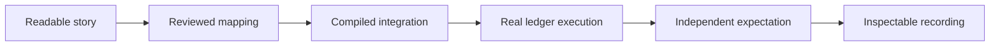

# Extend the system without losing the proof

An integration is useful when another reader can explain it, run it, and tell when it breaks. This final chapter follows a small change from an application contract to a checked, inspectable release.

## Start with a concrete application story

Choose a source action with a clear actor, subject, and observable result. Write a short Markdown input and an independent expectation before changing the implementation. Keep business names and exact values readable. The expectation should describe meaningful effects: which contract remains active, who can see it, whether progression completes, and what a rejected action leaves unchanged.

Use the [generated approval story](../stories/generated-approved/input.md) and its [expectation](../stories/generated-approved/expected.md) as the first model. For a transaction spanning domains, use the [final-leg transfer rejection](../stories/transfer-final-leg-rejected/input.md) and its [unchanged-state expectation](../stories/transfer-final-leg-rejected/expected.md). A successful compilation cannot replace these observations.



## Choose the integration boundary deliberately

An owned application can implement `StepAction` directly. An unchanged application can participate through a generated typed adapter when its actual choice shape is supported. The [extension guide](extension-guide.md) gives the exact files and commands for both paths.

A mapping explains which existing fields mean actor, readers, and subject. It does not repeat the compiler's type declarations. A source package with an unsupported return type or nested argument needs an explicit adapter design, not an invented interpretation. Inspecting a DAR does not grant execution rights, reveal private contracts, or install a live action.

Keep private data in its owning application. If another participant needs a result, design the minimal signed evidence and its consuming continuation. The issuer, consumer, subject, decision, and intended continuation all matter; the [purchase rejection cases](../stories/purchase-wrong-continuation/expected.md) demonstrate that boundary.

## Test the edge, then inspect the failure

Run the ordinary golden first, then its authority, retry, disclosure, and rollback cases. The [capability matrix](../docs/capabilities.md) links each supported boundary to an executable check. The [boundary input](../evaluations/execution-boundaries/input.md) and [expectation](../evaluations/execution-boundaries/expected.md) exercise maximum graph/composer sizes and two commands competing for one process.

In the story laboratory, open **Execute the supported limits and compete for one step**. Its two selectable phases show queried limits and the race's observed counts. The expected outcome is one committed advance, one definitive conflict, one replacement source, and one active process. The comparison table also includes the stale-reference, disclosure, and request-identity checks.

```sh
scripts/harmonia boundaries-check
scripts/harmonia bindings-check
scripts/harmonia portable-check
```

The generated mutation experiment deliberately compiles an adapter that omits the source exercise. Its core action completes, but the source remains pending; the golden must catch that difference. The portable check rebuilds source and vendor inputs with empty build directories, compares the resulting DAR identities, and runs the new example against the same independent expectation.

## Keep operational facts separate from business outcomes

A disconnected reader has not observed a business rejection. A timed-out submission may still commit. Reconcile the original request ID through the participant's actual history before making another attempt. The live client preserves that uncertainty and keeps new actions disabled while resolving it.

The local publisher and process owner are trusted to publish the definitions used here. The source application still enforces its own controllers. This tutorial does not claim protection against a malicious publisher inventing progress it is authorized to sign. Production deployment also needs its own durability, credential, network, and workload design.

The tested reference supports sixteen core steps, a fourteen-prerequisite join, four composed actions, eight proposal references per workspace, and bounded package/observation payloads. These are explicit evaluation limits, not a general throughput claim for arbitrary external contracts. Run one local ledger environment at a time and stop the owner when finished.

## Hand the next reader a working version

Deliver code, compiled artifacts, chapters, input/expected files, observations, and a manifest identifying the same checked source revision. Preserve the Git history and explain how to rebuild. The [developer walkthrough](../docs/developer-walkthrough.md) and [troubleshooting guide](troubleshooting.md) provide the operational path; the [glossary](glossary.md) explains the shared vocabulary.

Try changing one copied expected value and confirm that the checker and book both expose the mismatch. Then restore the committed expectation. When changing a baseline intentionally, explain the business behavior change in its commit. A reader should be able to distinguish implementation evidence, a local evaluation release, public publication, and external adoption.
