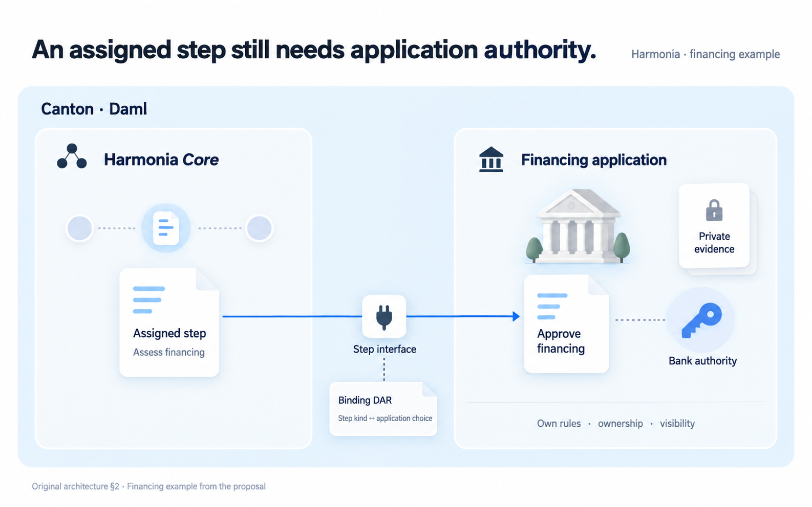
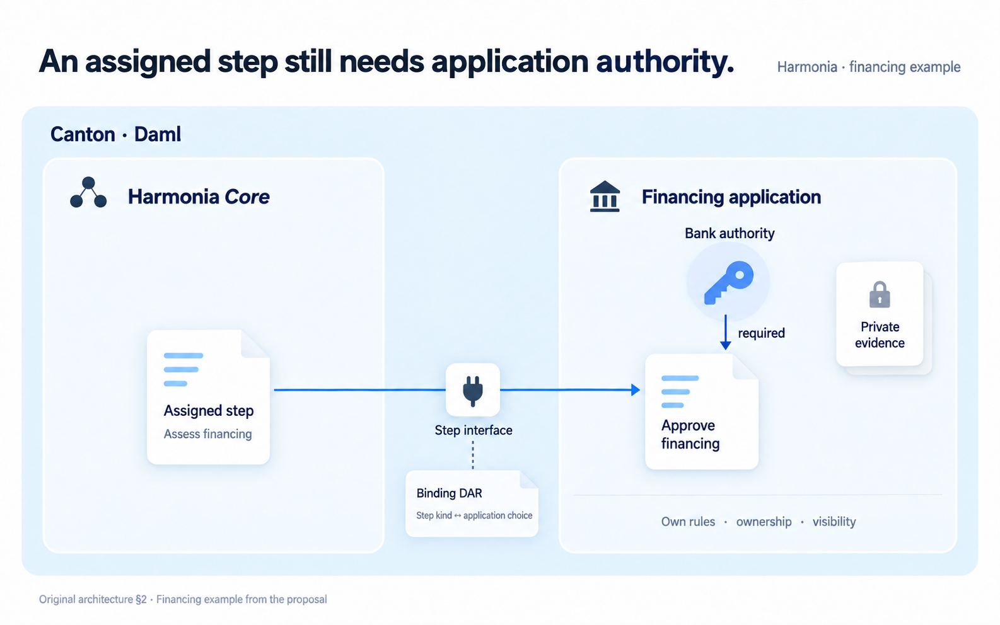

# Application authority: design record

Status: round 2 ready for Miguel's review.
Started: 2026-09-14 03:45:59 UTC.
Baseline: `4022a3a88525047a5616b96e7cab5b9d4bd9a132`.
Branch: `design/architecture-clarity-v2`.

This record follows one message from evidence to visual proposal. It records
decisions and their consequences, rather than a transcript of internal deliberation.
The existing HTML stays at its reviewed version until Miguel reviews this candidate.

## Intent

**Reader question:** does assigning a financing step give Harmonia the bank's authority?

**Intended understanding:** the workflow identifies the step and its actor; the
financing application still requires its own authority to execute the choice.

The first-look criterion is whether the reader can locate the required authority
inside the application boundary. This is a proposed reader check, not a measured
usability result.

## Source evidence

References below are pinned to the baseline commit. Quotations are exact;
their translation into pictures is a design interpretation.

| Source | Original wording | Consequence for the picture |
| --- | --- | --- |
| [S1: ledger placement][s1] | “composition state stays on-ledger” | Core and the application share an on-ledger context. |
| [S2: assignment][s2] | “actor : Party ← assignee”; “target : templateId · choice”; “authority : required from app” | A step points to a choice. Required authority stays with that application. |
| [S3: application][s3] | “own signatories”; “own observers”; “authorization preserved”; “privacy preserved” | Enclose choice, authority and private evidence within the application boundary. This does not assert that all data is secret from all other parties. |
| [S4: binding][s4] | “which step kind a choice fulfils” | Present the binding as a participation declaration associated with the interface. |
| [S5: concrete example][s5] | “A bank or financing domain evaluates those inputs and produces an approval or rejection outcome under its own process rules.” | Use one financing assessment to make the authority relationship concrete. |
| [S6: open questions][s6] | “Binding mechanism”; “Template & choice names in §2” | Do not invent exact imports, runtime dispatch or implemented template names. |

[s1]: https://github.com/miguelemosreverte/harmony-project/blob/4022a3a88525047a5616b96e7cab5b9d4bd9a132/docs/proposal/harmonia-architecture.html#L202
[s2]: https://github.com/miguelemosreverte/harmony-project/blob/4022a3a88525047a5616b96e7cab5b9d4bd9a132/docs/proposal/harmonia-architecture.html#L394-L411
[s3]: https://github.com/miguelemosreverte/harmony-project/blob/4022a3a88525047a5616b96e7cab5b9d4bd9a132/docs/proposal/harmonia-architecture.html#L435-L453
[s4]: https://github.com/miguelemosreverte/harmony-project/blob/4022a3a88525047a5616b96e7cab5b9d4bd9a132/docs/proposal/harmonia-architecture.html#L230-L250
[s5]: https://github.com/miguelemosreverte/harmony-project/blob/4022a3a88525047a5616b96e7cab5b9d4bd9a132/docs/proposal/harmonia.md#L133-L140
[s6]: https://github.com/miguelemosreverte/harmony-project/blob/4022a3a88525047a5616b96e7cab5b9d4bd9a132/docs/proposal/harmonia-architecture.html#L569-L575

## Refinement sessions

These four design passes took place in this working session, 2026-09-14.
They are not four separate meetings or user approvals.

### 1. Choose what the reader should learn

Starting point: “independent applications cooperate while retaining authority.”
That is too broad for a single image.

Decision: show one application action and the authority it still requires.
Keep the ledger as context. Defer the two integration paths, continuation and
atomic blocks to their own explanations.

### 2. Make the model concrete

The earlier definition-to-instance chain describes structure, but offers little
reason to care about each arrow. Use the proposal's financing example [S5][s5].

Working semantic sketch:

```text
Assigned financing step → step interface → application choice
                                              ↑
                                     required bank authority
```

“Assess financing” and “Approve financing” are reader-facing labels, not asserted
Daml identifiers. The approval choice is an illustrative target; no outcome is
claimed. The picture covers one action, not an entire financing decision process.

### 3. Translate responsibilities into visual language

| Meaning | Visual treatment | Misreading to avoid |
| --- | --- | --- |
| Common ledger context | One pale blue Canton/Daml enclosure | A server running the workflow off-ledger |
| Workflow assignment | A document in the Core area | Core granting the bank's authority |
| Application authority | A key next to the choice, inside the application boundary | A key arriving from Core |
| Private evidence | Locked document inside the application area | Documents traveling along the workflow connection |
| Participation mapping | Small declaration note attached to the interface | Binding DAR depicted as another runtime service |

Preserve the approved white/blue palette and soft dimensional pictograms.
The most visible elements are the assigned step, application choice and authority.
The binding note is secondary. There are no controls.

### 4. Converge on the first prompt

Chosen headline: **An assigned step still needs application authority.**

Remove the generic definition/instance prelude, the Dapp, package-manager plumbing
and success marks. Those do not help answer this image's question.
The prompt explicitly distinguishes authority from assignment and a schematic
connection from an observed transaction.

Visual references:

- [Approved workflow language](../../../../design/0.2/infographic/narrative-v1/desktop-reference.png).
- The original contract diagram, §2 of the supplied architecture HTML, captured
  directly at `.artifacts/original-diagrams/contract-model.png`.

Exact prompt sent to the built-in image generation tool:

```text
Use case: infographic-diagram.
Create one landscape architecture illustration, about 1600 by 1000, for the Harmonia book. The reader is a senior engineer with little time. Explain one fact: assigning a workflow step does not supply the application authority required to execute it.

References: image 1 is the approved visual language: white and pale blue surfaces, navy type, soft dimensional document and bank pictograms, restrained blue connectors and generous space. Image 2 is the original contract diagram and is the factual reference. Preserve its authority relationship, not its exhaustive schema. This is a new explanatory composition, not a color edit. Do not copy browser chrome, characters, navigation or a completed workflow from image 1.

Main headline, exact: "An assigned step still needs application authority."
Small context label: "Harmonia · financing example"

Build one wide pale blue enclosure labeled "Canton · Daml". Inside, two clearly separated responsibility areas, arranged left to right:
LEFT, title "Harmonia Core": one small three-node workflow motif and one large white document pictogram labeled "Assigned step". Its only explanatory line is "Assess financing".
RIGHT, title "Financing application": a softly dimensional bank pictogram, a choice document labeled "Approve financing", and a clearly visible key beside the choice labeled "Bank authority". The key and choice must both be INSIDE this application's enclosing border. A fine short connector from the key to the choice means required authorization, not a transfer of ownership.

Connect Assigned step to the application choice with one calm blue path through a small socket pictogram labeled "Step interface". The line must enter the application boundary and reach the choice, with generous clearance around labels. The binding is supporting explanation: below the socket place a SMALL folded declaration note titled "Binding DAR", with one line "Step kind ↔ application choice". A fine dashed annotation line connects this note to the socket. It is packaged participation information, not a third runtime service or a gateway box. No arrows claim package import direction.

Keep a locked document pictogram INSIDE the Financing application area, away from the connection path, labeled "Private evidence". It must never appear on a connector leaving that area. One small footer within the application area reads "Own rules · ownership · visibility".

Exact small source credit at the bottom: "Original architecture §2 · Financing example from the proposal"
No other visible words beyond those specified. The original specifies actor, target choice and authority required from the app; its exact template names and binding mechanism are illustrative or open. These display labels are explanatory, not names of implemented API calls.

Show a neutral explanation of requirements: no success ticks, progress completion, confirmed transaction, rejected outcome, token amounts, new workflow branches, return loops, server or authority delegated by Core. This is one financing step, not the whole purchase process. Avoid dense UML panels, legends, duplicated sentences, hover cues, buttons and decorative avatars. The bank's ownership of the authority must be visually obvious even before reading the supporting text.
```

## Image iterations

Each actual tool call gets an entry with its prompt, references, UTC times,
artifact name, SHA-256, eventual commit, visual critique and decision. Preserve
earlier images. A refinement should address a specific observed weakness.

### Round 1 — establish the composition

- Tool: built-in image generation; exact prompt in session 4 above.
- References: approved workflow image, then original contract diagram.
- Started: 2026-09-14 03:48:43 UTC.
- Returned: 2026-09-14 03:49:26 UTC.
- Artifact: [01-authority.png](01-authority.png).
- Commit and SHA-256: recorded in the artifact register below.



**Assistant review:** the two boundaries and the small binding declaration help.
The bank's key remains inside its application and private evidence is not placed
on the inter-application connector. However, the large bank building competes
with the key, and the unlabeled progress row repeats the Core heading icon.
The dotted key-to-choice relation also leaves “required authority” too implicit.

**Decision:** keep this candidate as evidence. Refine the hierarchy: remove the
two redundant decorations and place the key above the choice with a clearly
labeled requirement connection. This is not a user approval.

### Round 2 — make the requirement visible

Edit target: `01-authority.png`. Exact prompt:

```text
Edit this image to strengthen the hierarchy of the SAME authority explanation. Preserve its palette, typography, headline, all main panel boundaries, the Assigned step and Approve financing documents, Step interface, Binding DAR note, private evidence, source credit, and the horizontal workflow arrow.

Two supporting decorations currently compete with the central message. Remove the large bank building from inside the Financing application panel; keep the small bank icon beside that panel heading. Remove the unlabeled three-stop progress row inside Harmonia Core; keep its small workflow icon beside the heading.

Use the space vacated by the large bank building for the blue key. Place that key directly ABOVE the Approve financing document, comfortably INSIDE the Financing application panel. Put its exact label "Bank authority" just above or beside it. Connect the key DOWNWARD to the top of the Approve financing document with one fine navy arrow labeled "required". The connector is a requirement relationship, not an observed authorization event. Leave generous clearance around the word "required" and the key label.
Remove the old key and its old horizontal dotted connector at the right of the choice. Do not leave a duplicate key.
The existing blue workflow arrow must still arrive from the LEFT of the Approve financing document through the Step interface. It must not point at the key. Visually separate workflow assignment from authority that belongs inside the application.

No other new words. No success ticks, lock-opening animation, completed states, transaction results, new cards, controls or additional arrows. Keep private evidence entirely inside the application's boundary. Make the bank's authority the dominant detail on the application side; private evidence and the binding note remain supporting details. Everything must remain readable and uncropped.
```

- Tool: built-in image generation, editing `01-authority.png`.
- Started: 2026-09-14 03:50:28 UTC.
- Returned: 2026-09-14 03:51:09 UTC.
- Artifact: [02-authority.png](02-authority.png).
- Commit and SHA-256: recorded in the artifact register below.



**Assistant review:** the key now has an explicit “required” connection to the
application choice. Both ends are inside the application boundary, while the
workflow connection arrives from outside. The building and redundant progress
row are gone. This makes the authority relationship more prominent. The image
retains the binding declaration as a small note and private evidence inside the
application. Text and connectors appear uncropped in the generated image.

**Remaining questions for Miguel:** does the key communicate permission clearly?
Does the interface and binding note help at this point, or compete with the main
message? There is substantial empty space above the assigned step; moving the
whole path upward could tighten the composition, but that needs to be judged
against the current breathing room.

**Semantic qualification:** the key is a metaphor for required authorization,
not a proposed cryptographic key-custody design. The arrows explain relationships;
they do not prove execution or show an observed approval. This candidate has been
visually inspected, not tested as a responsive HTML implementation.

**Decision:** present round 2 for Miguel's review. Keep round 1 and its critique.
No further generation or change to the published book in this review cycle.


## Miguel's review

Earlier feedback guiding this attempt, quoted from the conversation:

> I think I like the overall language. The colors and so on, I like, but yes, there may be room to think about what it is that we actually want to say.

**Review of this candidate: pending.**

When Miguel reviews it, append his actual words, the candidate filename and
commit he saw, when the review was recorded, and the resulting decisions.
Assistant critiques and user decisions stay explicitly attributed.
