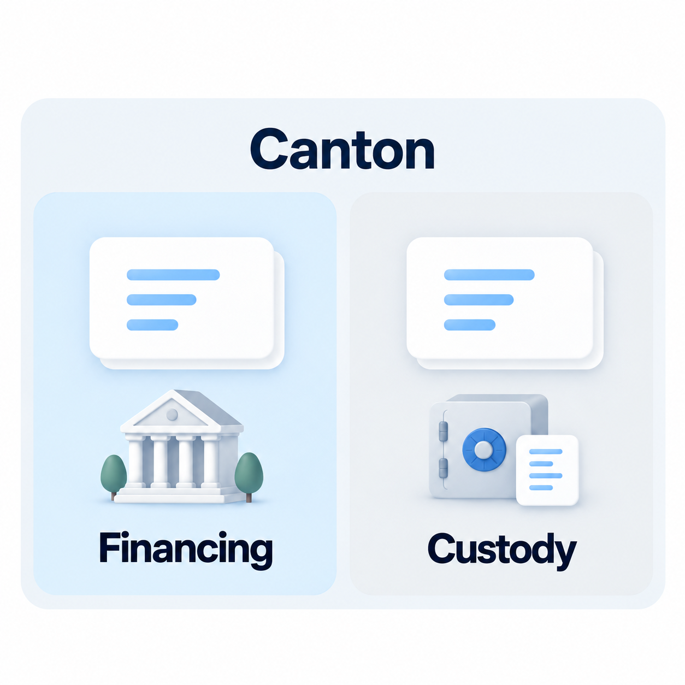
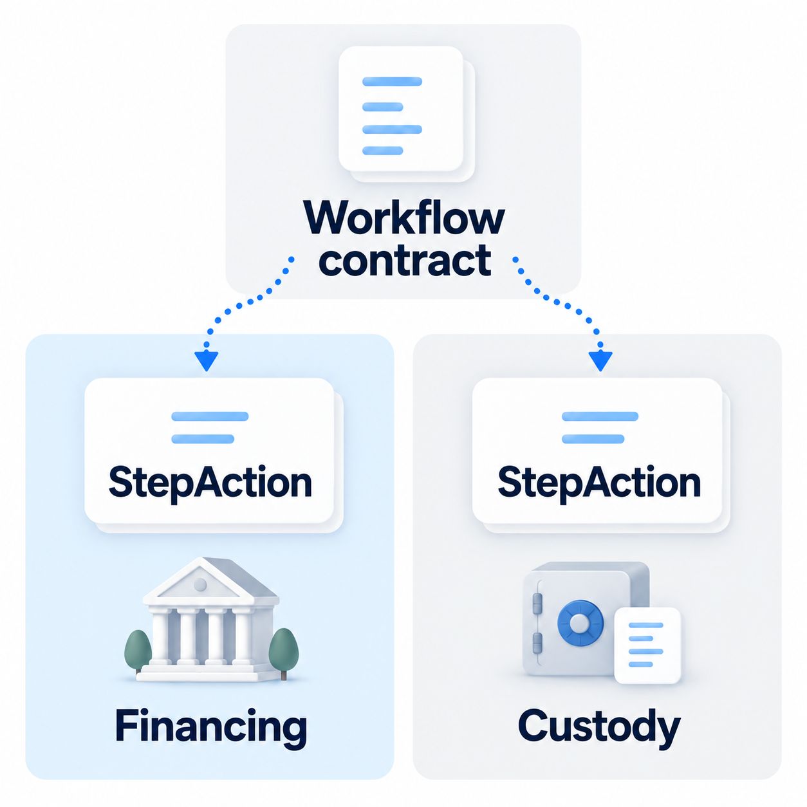
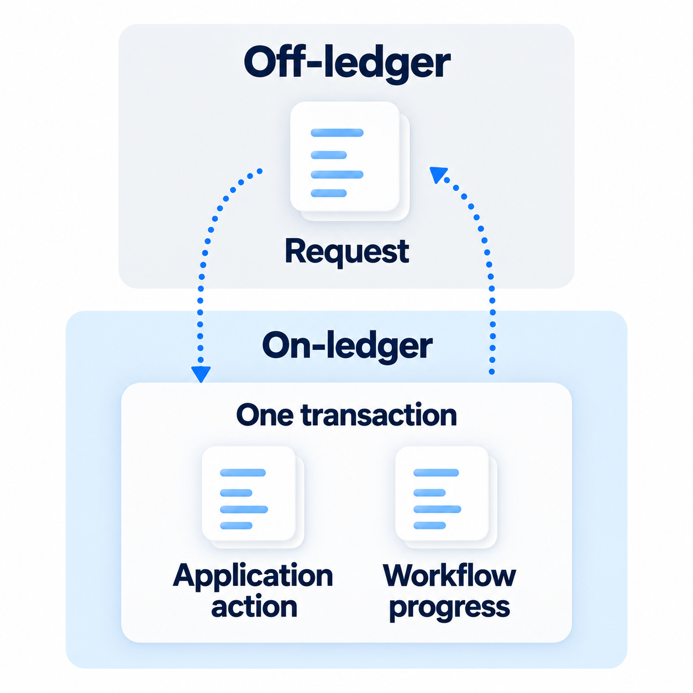

# Harmonia architecture

## Contracts on Canton

[Canton](https://docs.canton.network/overview/understand/what-is-canton) lets organizations transact through Daml smart contracts while controlling who can see their data. Banks are using this technology: Lloyds reported a [tokenised-deposit pilot](https://www.lloydsbankinggroup.com/media/press-releases/2026/lloyds/lloyds-tokenisation.html) on Canton.

Here, a financing contract can approve a loan; a custody contract can release an asset. Each application controls its own rules and permissions.

## Harmonia gives them a shared interface

Canton already supports transactions across applications. Harmonia gives participating contracts a common interface, **StepAction**, so a workflow can coordinate their actions without importing each application's implementation.

The workflow selects an eligible action, checks who may execute it, and calls the shared **ExecuteAction** operation. The application's own permissions still apply.

## Request off-ledger, execute on-ledger

Off-ledger software submits requests and reads confirmed results. On-ledger contracts enforce both the workflow and application rules.

**An application action and that step's progress commit together.** If either fails, neither change is recorded.

An application can implement the interface directly. For supported existing applications, **Builder** generates an adapter off-ledger from a reviewed mapping. That adapter implements the interface and runs on-ledger, leaving the original application unchanged.

---

Project basis: *Development Fund Proposal*, Abstract and §2, checked against the current implementation.
