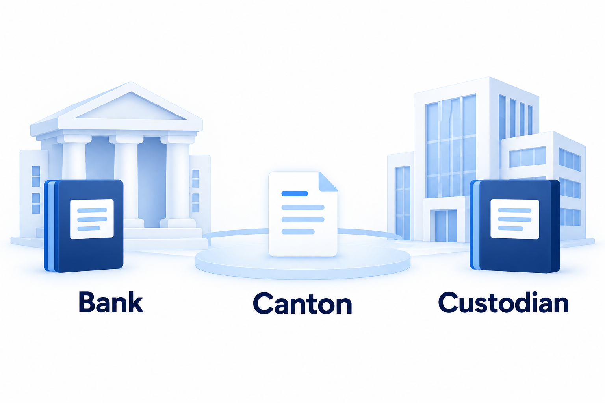

# Harmonia architecture

## Start with Canton

Banks need to agree on transactions without exposing every customer's records. [Canton](https://docs.canton.network/overview/understand/what-is-canton) is a blockchain network designed for that combination: shared transactions with selective visibility.

Applications on Canton use **Daml** smart contracts to describe their records, permitted changes and required authorizations. Banks are using this technology: Lloyds reported a [pilot purchase of a government bond using tokenised deposits](https://www.lloydsbankinggroup.com/media/press-releases/2026/lloyds/lloyds-tokenisation.html) on Canton.

*Separate records; agreement on a shared transaction.*

## A shared network, different applications

A bank's application might approve financing; a custodian's might release an asset. Each has its own contracts, operations and permissions.

Canton already supports transactions across applications. The developer still has to specify the larger process: which action comes next, who must perform it, and which result permits work to continue.

**Harmonia makes those coordination rules reusable.** Its workflow contracts record the permitted sequence, assigned participants and progress. They run on Canton alongside the application contracts.

## Give each action the same calling convention

For a workflow to invoke different applications, they expose a small Daml interface called **StepAction**. It presents two pieces of information: **actor**, the party required to authorize the call, and **subject**, the business reference the action concerns.

It also exposes **ExecuteAction**. Calling it runs the application's implementation and returns a contract reference for the resulting action state.

Harmonia can therefore check the actor and subject, then invoke the action without importing that application's implementation. The application continues to enforce its own business rules and authorization requirements.

An application can implement StepAction directly. An existing application can instead use an **adapter**: a separate contract that implements StepAction and calls a specific operation in that application. For supported application shapes, Builder generates this adapter from a developer's reviewed mapping; it is compiled and deployed before use.

## Keep the action and its progress together

Harmonia's workflow engine, **Core**, checks that the requested step is available, the requester is assigned, and the actor and subject match the target action.

Core then calls ExecuteAction and records the step's completion. **That application action and its workflow progress commit in one ledger transaction.** If either fails, neither change is committed. A process involving later decisions advances through further transactions.

When one process supplies a result to another, the receiving process checks its issuer, intended recipient and permitted continuation before advancing.

## Where the browser and Scala fit

The browser displays the process and sends requests over HTTP to a **Scala service**. The service reads the relevant ledger state and submits supported commands through the participant's Canton connection.

The Daml contracts enforce the changes. The service reads the confirmed result to update the browser. If a submission's outcome is uncertain, it checks ledger commits before reporting completion.

Workflow authority and progress therefore live on the ledger. The browser and Scala service provide access to them.

---

Project basis: *Development Fund Proposal*, Abstract and §2, checked against the current implementation.
