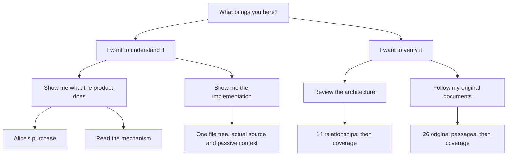

# Walk through the book, one decision at a time

Start at `design/0.2/book-overview.html`. A reader sees a short explanation and two
choices. There is no navigation drawer or selector strip to learn. The four paths
separate the reader's purpose before presenting the detailed material.

Every arrow here is an authored destination. There is no generated menu of all
possible states. Browser Back is available throughout. The two choices within a
page are the whole body interaction budget; the repository tree is the single
explicit composite exception.

## The public story

On the product introduction, Alice's need supplies the reason to care. **Follow
Alice's purchase** opens the approved infographic. **Understand the mechanism**
starts chapter one. Daml/Canton explanations remain concrete: application choices
retain authority, a scoped result enables another action, and a submitted request
is not an observed completion.

The initial scene leads to two recorded outcomes: approval or refusal. Each outcome
has its own finite sequence. Previous changes the observed moment; Next advances
to the next moment. The last purchase scene leads to the transfer chapter. It never
wraps silently to the first picture. The transfer likewise offers successful
settlement or a refused final leg, then continues to application integration.

The scene itself is passive. People and arrows are explanations, not controls.
The caption says what changed. Provenance below it identifies the historical run.
The full recording review retains deliberate unauthorized attempts that are omitted
from the four-beat public summary.

## Each chapter and its next destination

The chapter heading and navigation arrive before lengthy explanatory diagrams.
Reading prose comes first; its diagram follows. Original quotations have their
own author path and remain addressable through the chapter's source URL.

| Page | Purpose and information | Primary next action | Other action |
| --- | --- | --- | --- |
| 01 · What Harmonia provides | Explain a shared handoff between independently owned applications | Read roles and trust | Return to product introduction |
| 02 · Who can act, and why | Explain authority, scoped results and participant visibility | Follow Alice's purchase | Previous chapter |
| 03 · Alice buys a home | Show one recorded financing/offer handoff and its result | Next scene; then transfer | Previous scene or recorded outcome choice |
| 04 · A transfer across four parties | Show preparation and the final transaction, including rollback | Next scene; then integration | Previous scene or recorded outcome choice |
| 05 · Connect your application | Explain direct interfaces, adapters and their supported boundary | Open the integration choice | Previous chapter |
| Application integration choice | Decide whether to try a package or continue reading | Open the package sandbox | Continue to chapter 06 |
| 06 · Do the next task | Explain Bank, Buyer, observer and consented composition | Open the workflow choice | Previous chapter |
| Shared workflow choice | Decide whether to try the live workflow or continue reading | Open the composition sandbox | Continue to chapter 07 |
| 07 · What the evidence proves | Separate exact quotation, execution, integration and adoption claims | Choose the evidence to follow | Previous chapter |
| Recording choice | Decide between a detailed recording review and readiness | Walk through all recordings | Continue to chapter 08 |
| 08 · Readiness and adoption | Identify what local evidence proves and what remains external | Read proposal context | Previous chapter |
| 09 · Proposal context | Preserve commercial and project context without implying acceptance | Read context and references | Previous chapter |
| 10 · Context and references | Preserve related-work context and attribution | Explicitly finish at the entrance | Previous chapter |

The recording route visits all **32 examples and 130 observations**. It shows
expected and actual data together, without evidence tabs or an inspector. Its last
observation goes to coverage. Returning to the entrance is explicitly labeled as
finishing the route, not playback wrapping around.

## The developer

Choose Understand, then Implementation. The left side is one native file tree.
Select a file to update its name, repository path, authored responsibility, colored
source and slice context. The right side has no tabs or clickable line numbers.
The sole other action returns to the entrance.

The selected file and line are in the address. Cold URLs and browser Back/Forward
restore them. Highlighting preserves the original text; the exporter checks every
source fingerprint. Generic product module comments explain product responsibility.
Book-specific chapter maps live in the book.

On mobile, the tree comes first and stays within a bounded scrolling pane. The
selected file is brought into that pane's view. The source follows below it and
scrolls independently for long code lines.

## The reviewer

Choose Verify, then Architecture. The first page asks what leaves the bank and who
may use it. Previous/Next sit above the diagram. The route contains **14 frames**:
six authored reading maps, five manifest relationships and three execution paths.
Each explicitly identifies the kind of relationship it depicts.

Below the passive diagram, each stage has its explanation and source identity.
The evidence and gap text say what to challenge. The original architecture drawings
remain available below, labeled as proposal drawings. Next at the final frame leads
to coverage. No node opens a new navigation surface.

## The original author

Choose Verify, then Original documents. The left pane contains all original
passages, with the selected passage highlighted. The right pane reuses the matching
workflow, relationship or chapter explanation. It offers no independent controls.
Previous/Next sit above the work area and move through **26 passages**. Scrolling
the original pane also updates the selected passage and its URL.

The desktop view puts original and companion side by side. On mobile, the original
pane appears above the companion. The text tells the reader that this is the same
relationship in a stacked layout. The last passage leads to coverage, where exact
inclusion and demonstrated implementation remain distinct.

Coverage shows **736/736 units and 8,110/8,110 words** under the documented counting
rule. Individual claims are readable cards on mobile. They identify the original
source, the local assessment and the next evidence; they do not collapse these
facts into a product-completion score.

## The separate live product

The book's sandbox page explains the chosen task and links outward to the product.
It also offers Continue reading. Without a running sandbox, it links to the relevant
recorded example. The private launcher supplies participant links; the product does
not contain book links, book routes or book configuration.

| Screen | Purpose | Available actions |
| --- | --- | --- |
| Session entry | Obtain the provisioned participant identity | Paste one link; enter |
| Bank financing | Review the private case | Approve financing; choose next task |
| Buyer financing | Continue with the signed approval | Continue; choose next task |
| Observer | Read shared completion | Choose next task |
| Task choice | Pick shared work or application integration | Compose; bring an application (Bank) or return to financing |
| Composition text question | Supply one name, reference, count or role | One input; Continue |
| Composition choice | Assign an actor, action or integration | Two named alternatives |
| Composition review | Review the exact plan before proposal | Review answers; propose |
| Consent | Buyer reviews the observed proposal | Accept; choose next task |
| Execution | The assigned participant performs the enabled action | Execute; choose next task |
| Completion | Read the observed final state | Continue to another plan/task |
| Package input | Select the source of the compiled application | Upload; verified source |
| Package upload | Supply one DAR | File chooser; inspect |
| Verified source | Read one operator-supplied source | Retrieve; next source |
| Inspected package | Read mapping support and independent live availability | Generate/compile when supported; choose another input |
| Compiled package | Obtain the real compiled project | Download; choose another input |
| Interrupted connection | Restore the connection before further work | Reconnect, or retry the same unresolved request when connected |

A composition draft and question survive a cold URL. A package's selected input is
addressable. A live address selects a task and participant-visible current state;
it cannot replay a past mutable ledger snapshot. Private capabilities are stripped
from ordinary navigation URLs.

## What changed after looking at the screenshots

- The public introduction's technical graph delayed its two choices. It was removed;
  the introduction now has one concrete story and two clear destinations.
- Reviewer and author actions were below long work areas. They now appear above them.
- The selected file could be outside the tree's visible region on mobile. Only that
  pane now scrolls to the selected entry; the whole page does not jump to the code.
- The mobile coverage table did not overflow, but its words wrapped into unreadable
  strips. Claims now use stacked cards. This was a visual finding, not a failed width test.
- Chapter one initially opened with a tall technical diagram. Its prose and navigation
  now precede the diagram. The recording review likewise places its current action
  and navigation above potentially tall branch graphs.
- The composition review repeated its title below the graph. That duplicate was removed.
- The package graph implied that this compilation created its existing live registration.
  It now branches from mapping to compilation and independently checked availability.
- The recovery caption claimed the old state was visible after the page had focused on
  recovery. It now says to reconnect to resume the task.

The [screenshot review](PAGE-REVIEW.md) contains desktop/mobile captures with purpose
and expected action. The [live screen review](LIVE-PAGE-REVIEW.md) documents the actual
participant pages. Machine-readable results accompany them; screenshots establish
layout, while real observed ledger results establish execution.

The standalone export also received a desktop/mobile pass. Its [mobile recording](../../design/0.2/quiet-review/exported-recording-390.png) uses the same two-action layout. The [actual PDF page](../../design/0.2/quiet-review/pdf-first-page.png) was rasterized from the exported PDF and checked for readable text and spacing. Written chapters remain usable with JavaScript disabled.
