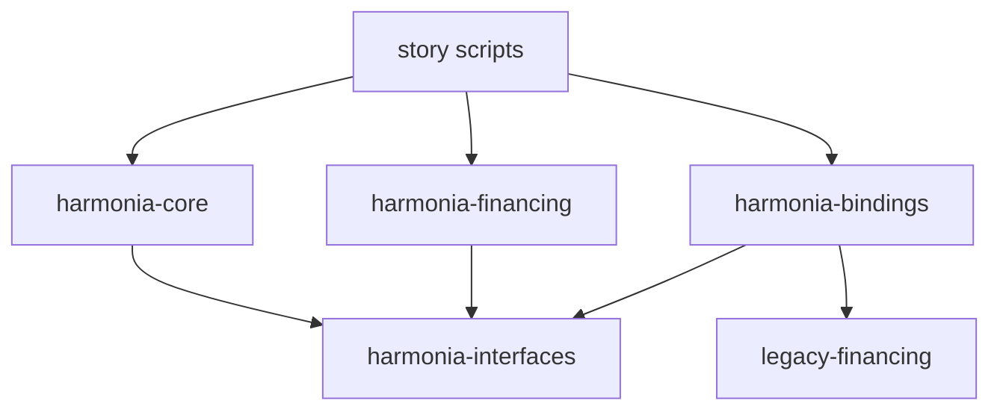

# ADR 001: interfaces and typed application bindings

Status: implemented and verified for a single consuming approval action; see the [evidence](../verification/05-adapter.md).

## Decision

A small `harmonia-interfaces` package owns `StepAction` and its view. The core depends only on this package. An application can implement the interface directly, or a separate binding can implement it and delegate to an existing application choice.

Arrows mean package dependencies. A DAR includes its main package and dependencies; it is not a deployed contract or a participant node. Neither the API nor the core imports a source application. The legacy source imports no Harmonia package.

## Direct execution

`WorkflowInstance.Advance` checks its state, the assigned actor, and the action's subject. It exercises `StepAction.ExecuteAction`, then creates the completed workflow. The source application implements the interface by exercising its own consuming `Approve` choice.

`ExecuteAction` is deliberately nonconsuming: the application's actual choice owns consumption and validation. If any nested action fails, the whole advance fails, including consumption of the old workflow.

## Bound execution

`ApprovalBinding` has the bank as signatory and the buyer as observer. It stores a typed source contract identifier. Its consuming `ApplyApproval` choice checks that the source bank, buyer, and subject match the binding, exercises the source's `Approve`, and creates a replacement binding pointing to the approved source contract.

The workflow completes, the binding is replaced, and the source application is replaced in one transaction. A source failure rolls back all three. Assignment alone provides no new application authority: the actual application choice remains responsible for authorization.

## Artifact identity

The legacy source DAR was built and inspected before the adapter was built. Its [identity record](../../on-ledger/legacy-financing/identity.json) fixes both the DAR SHA-256 and main package ID. The Scala suite verifies these values and inspects the source's packaged dependencies before ledger execution. Rebuilding with the pinned compiler reproduces the artifact locally. A change requires explicit review of the source and identity record.

This source is a small application maintained in this repository to make the experiment reproducible. It models integrating an existing DAR; it is not represented as an externally adopted production package.

## Supported boundary

The demonstrated binding handles one consuming choice with no arguments and a result containing the replacement contract of the same template. Authority, observer set, and subject must agree with the typed source. It does not provide arbitrary dynamic choice invocation, authority delegation, private transaction-tree isolation, or a generic code generator.

The direct and adapter stories share the same externally meaningful expected behavior. Raw artifacts retain the distinct source contract identities; the adapter also adds its own contracts. The golden `active_contracts` count refers specifically to source application contracts, not every contract on the ledger.

Separate-participant privacy must be tested independently. In particular, observers of a parent exercise can learn information from child transactions; a shared progress contract must not be treated as a privacy barrier for a nested application operation.
